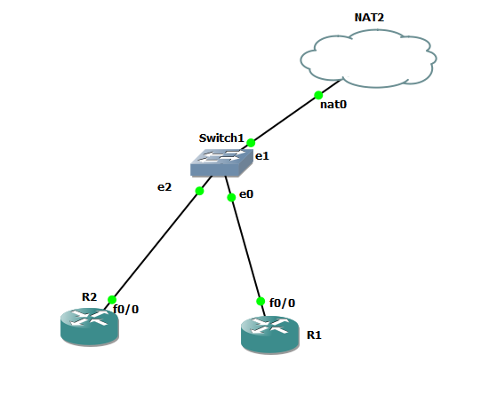

# Ansible for network automation



## Rockey linux
```
dnf update
dnf install epel-release
dnf install vim net-tools traceroute htop
dnf install ansible


ansible --version
ansible --list-hosts all


# add below config to /etc/ansible/ansible.cfg
------
[ssh_connection]
ssh_args = -o KexAlgorithms=+diffie-hellman-group1-sha1,diffie-hellman-group14-sha1,diffie-hellman-group-exchange-sha1
------


```

### add ssh config 
```
vim .ssh/config


Host 192.168.229.170
    KexAlgorithms +diffie-hellman-group-exchange-sha1
    HostkeyAlgorithms +ssh-rsa
    Ciphers aes128-cbc,3des-cbc,aes192-cbc,aes256-cbc
```


## R1

```

int fa 1/0
no sh
ip address dhcp
ip nat outside

int fa 0/0
no sh
ip addr 10.10.1.1 255.255.255.0
ip nat inside


ip access-list standard NAT-ACL
permit 10.10.1.0 0.0.0.255
exit

ip nat inside source list NAT-ACL interface fastEthernet 1/0


ip domain-name iman.local
crypto key generate rsa
ip ssh version 2


username iman privilege 15 secret iman
line vty 0 2
login local
transport input ssh


```


## R5

```


int fa 0/0
no sh
ip addr 10.10.1.5 255.255.255.0


```

## R4

```


int fa 0/0
no sh
ip addr 10.10.1.4 255.255.255.0


```

## R6

```


int fa 0/0
no sh
ip addr 10.10.1.6 255.255.255.0


```